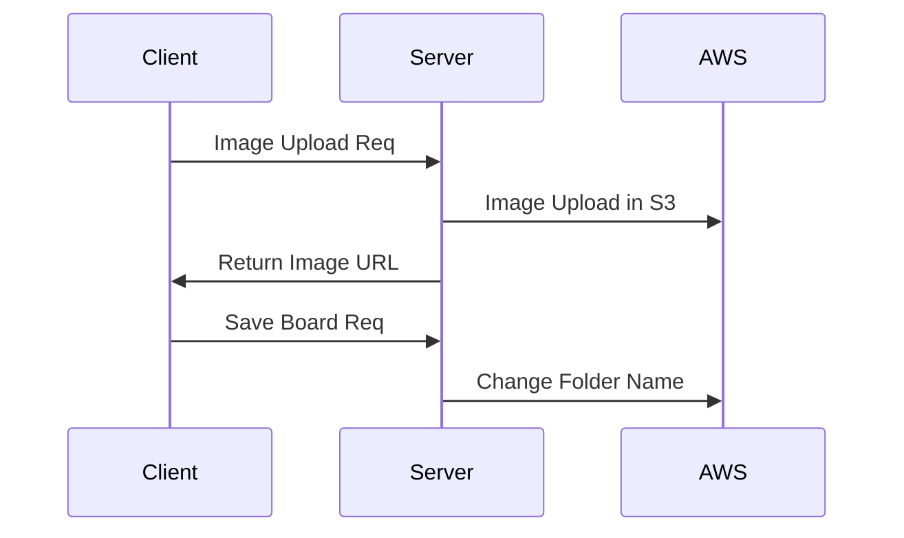

# [ Hello Developer ] 개발자를 위한 커뮤니티 서비스


웹개발에 있어 개발 사이클의 전반적인 흐름을 경험하기 위해 진행한 개인 프로젝트 입니다.

실제 서비스는 [헬로디벨로퍼](https://hdev.site) 에서 사용이 가능합니다.

<br/>

# 🎨 Enviroment

### 에디터

- Visual Studio Code
- DBeaver
- Mysql Workbench

### 디자인

- Figma
  <br/>


### ETC

- Notion
  <br/>
  <br/>

# 🔨 Tech Skills

## 🖥 백엔드

### 언어 / 프레임워크

- Typescript
- Nestjs

### 데이터베이스

- Mysql + TypeORM

### 인프라

- AWS EC2
- AWS S3
- AWS ACM
- AWS Route53
- AWS ELB(ALB)
- AWS RDS
- AWS ECR
- Docker

### 인증

- Passport.js

<br/>

## 💻 프론트엔드

### 언어 / 라이브러리

- Typescript
- React

### 상태관리

- Recoil

### 디자인

- Styled-components

### 인프라

- AWS S3
- AWS CloudFront
- AWS Route53
  <br/>

## 🔑 ETC

- CI/CD : Github Actions
- Markdown Editor/Viewer : Toast UI Editor
  <br/>
  <br/>

# ✍Database E-R Diagram


  <br/>
  <br/>

# 🌐 System Architecture


## 배포 방식

#### EC2에서 Docker를 활용하여 배포하였습니다.

#### AWS ACM에서 발급받은 SSL인증서를 사용하여 ELB(ALB)를 통해 HTTPS를 적용했습니다.

<br/>

#### 배포과정은 아래 블로그에 정리했습니다.

- [1. EC2 + Docker로 Nestjs App 배포하기](https://iamiet.tistory.com/entry/EC2-Docker-ECR%EB%A1%9C-Nestjs-%EC%96%B4%ED%94%8C%EB%A6%AC%EC%BC%80%EC%9D%B4%EC%85%98-%EB%B0%B0%ED%8F%AC%ED%95%98%EA%B8%B0)
- [2. ACM + ALB로 HTTPS 적용하기](https://iamiet.tistory.com/entry/AWC-ACM-ELBALB%EB%A5%BC-%EC%82%AC%EC%9A%A9%ED%95%98%EC%97%AC-EC2%EC%97%90-HTTPS-%EC%A0%81%EC%9A%A9%ED%95%98%EA%B8%B0)

<br/>

## CI/CD

#### Github Actions를 사용하여 Docker Image를 빌드하고 ECR에 업로드 합니다.

#### EC2에서는 ECR에 업로드된 이미지를 받아오고 Docker Image를 실행하여 배포합니다.

#### CI/CD 구축과정은 아래 블로그에 정리했습니다.

- [Nestjs + Docker CI/CD 구축과정](https://iamiet.tistory.com/entry/EC2-ECR-Docker%EB%A5%BC-%ED%99%9C%EC%9A%A9%ED%95%9C-CICD-%EA%B5%AC%EC%B6%95-with-Github-Actions)
  <br/>


## 배포 방식

#### S3의 정적 웹 호스팅을 사용하여 CloudFront로 배포했습니다.

#### AWS ACM에서 SSL인증서를 발급받아 HTTPS를 적용했습니다.

<br/>

#### 배포과정은 아래 블로그에 정리했습니다.

- [1. S3 웹호스팅](https://iamiet.tistory.com/entry/AWS%EC%97%90-React-%EB%B0%B0%ED%8F%AC%ED%95%98%EA%B8%B0-1-S3-%EC%9B%B9%ED%98%B8%EC%8A%A4%ED%8C%85-%EC%84%A4%EC%A0%95)
- [2. Route53 및 ACM 설정](https://iamiet.tistory.com/entry/AWS%EC%97%90-React-%EB%B0%B0%ED%8F%AC%ED%95%98%EA%B8%B0-2-Route53-%EB%8F%84%EB%A9%94%EC%9D%B8-%EC%97%B0%EA%B2%B0-%EB%B0%8F-SSL-%EC%9D%B8%EC%A6%9D%EC%84%9C-%EB%B0%9C%EA%B8%89)
- [3. CloudFront 배포](https://iamiet.tistory.com/entry/AWS%EC%97%90-React-%EB%B0%B0%ED%8F%AC%ED%95%98%EA%B8%B0-3-CloudFront-%EB%B0%B0%ED%8F%AC%ED%95%98%EA%B8%B0)
- [4. Route53 레코드 매핑](https://iamiet.tistory.com/entry/AWS%EC%97%90-React-%EB%B0%B0%ED%8F%AC%ED%95%98%EA%B8%B0-4-CloudFront-Route53-%EC%82%AC%EC%84%A4%EB%8F%84%EB%A9%94%EC%9D%B8-%EC%97%B0%EB%8F%99%ED%95%98%EA%B8%B0)

## CI/CD

#### Github Actions를 사용하여 리액트 프로젝트 빌드이후 S3에 업로드됩니다.

#### S3의 변경사항이 바로 적용될 수 있도록 CloudFront에서 Invalidate Cache를 적용했습니다.

<br/>

#### CI/CD 구축과정은 아래 블로그에 정리했습니다.

- [React CI/CD 구축과정](https://iamiet.tistory.com/entry/S3%EB%A1%9C-%EB%B0%B0%ED%8F%AC%ED%95%9C-React%EC%97%90-CICD-%EA%B5%AC%EC%B6%95%ED%95%98%EA%B8%B0-with-Github-Actions)

<br/>
<br/>

# ✔ Test

## Unit Test

### 각 API의 Controller와 Service 레이어에 대한 90개의 유닛테스트 케이스를 작성했습니다.


### 상위 레이어에 의존하는 로직의 경우 테스트의 격리를 위하여 Mocking 처리했습니다.

### 유닛테스트의 경우 Auth, User 등과 같이 모듈별로 폴더에 존재합니다.


<br/>
<br/>

## E2E Test

### 모든 API에 대한 65개의 통합테스트 케이스를 작성했습니다.


### 테스트시간을 줄기이 위하여 실제 DB가 아닌 인-메모리 DB인 SQLite를 사용했습니다.

### 통합테스트의 경우 루트폴더 하위 test 폴더에 존재합니다.


<br/>
<br/>

# 📜 API Docs with Swagger

### Restful API의 문서를 자동으로 구성해주는 Swagger 프레임워크를 사용해서 작성했습니다.

### API 문서 URL : [Hello Developer API Docs.](https://api.hdev.site:5000/api)

<br/>


<br/>
<br/>

# ❗ 해결했던 문제들...

## 이미지 업로드 최적화하기

에디터를 통해 이미지 업로드 및 DB에 저장시 아래와 같은 상황이 발생했습니다.

- 마크다운 에디터에서 이미지 삽입시 인코딩되어 본문의 길이가 길어지는 상황
- 약 4kb의 이미지 삽입시 약 5100자의 문자열이 삽입
- 본문의 길이가 늘어날수록 DB에서 차지하는 공간이 커지게되며, 삽입/삭제 등 데이터의 크기가 늘어날수록 더 많은양의 네트워크 트래픽을 요구


이미지 업로드 이벤트를 커스텀하여 AWS S3에 업로드 및 이미지 URL을 반환하여 업로드를 최적화 했습니다.

해결과정은 [Tistory 블로그](https://iamiet.tistory.com/entry/toast-ui-editor-v3-%EC%9D%B4%EB%AF%B8%EC%A7%80-%EC%97%85%EB%A1%9C%EB%93%9C-%EC%B5%9C%EC%A0%81%ED%99%94%EC%BB%A4%EC%8A%A4%ED%84%B0%EB%A7%88%EC%9D%B4%EC%A7%95%ED%95%98%EA%B8%B0)에 정리했습니다.
<br/>
<br/>

## 이미지 업로드시 게시글 ID 생성관련 이슈

기존 게시글을 작성하는 DB Column 생성시 UUID 형식의 랜덤한 게시글 ID가 생성되는 형식  
하지만 이미지 업로드시에 게시글이 DB에 저장되는 시점보다 이전에 업로드 이벤트가 발생
<br/>

위와 같은 문제점을 아래와 같이 방법으로 개선하였습니다.

- 게시글 생성시 클라이언트에서 임시 게시글 ID 생성
- 임시 게시글 ID를 기준으로 S3에 /temp-board-id/image.png 형식으로 업로드
- 게시글이 저장되는 시점에 게시글 DTO에 UUID 문자열을 ID로 추가
- 게시글이 저장되는 동시에 S3에 존재하는 temp-board-id를 실제 게시글 ID로 치환



<br/>

## 회원가입시 이메일 인증 구현하기

nodemailer + gmail을 사용하여 이메일 인증을 구현중 아래 문제가 발생했습니다.

- 2022.05.30 이후 OAuth2.0 미사용시 Gmail API 사용 불가
- 공식문서에서는 OAuth 사용방법과 관련된 자세한 방법이 나와있지 않았음

위 제약사항으로 인해 Gmail API의 OAuth와 nodemailer를 사용하여 인증메일 발송기능을 구현했습니다.


해결과정은 [Tistory 블로그](https://iamiet.tistory.com/entry/Nodemailer-Gmail-OAuth20%EC%9C%BC%EB%A1%9C-%EC%9D%B4%EB%A9%94%EC%9D%BC-%EB%B0%9C%EC%86%A1%EA%B8%B0%EB%8A%A5-%EA%B5%AC%ED%98%84%ED%95%98%EA%B8%B0)에 정리했습니다.
<br/>
<br/>

## JWT Access Token의 짧은 수명으로 인한 유저의 불편한 경험개선

기본적으로 Access Token의 경우 localStorage등 클라이언트(브라우저)의 저장공간에서 보관합니다.  
이에 따라서 수명이 길면 탈취당했을때 문제가 발생할 수 있습니다.  
JWT Refresh Token을 활용하여 유저의 사용경험이 불편하지 않도록 개선했습니다.

- 토큰의 유효시간의 경우 Access Token은 15분, Refresh Token은 10일로 지정
- Refresh Token은 httpOnly, Secure 옵션으로 쿠키에 저장
- 서버에서 401 Unauthorized 에러 반환시 Refresh Token을 활용한 재요청 및 Access Token 재발급

```typescript
res.cookie('refreshToken', refreshToken, { httpOnly: true, path: '/', secure: true });
```


<br/>

## 조회수 증가 API의 반복적인 호출 문제해결

게시글 상세보기를 누르게되면 조회수를 증가하기 위해 API를 호출하게 됩니다.  
이때 이미 조회한 게시물도 계속 API 호출이 들어오게 됩니다.  
사용자가 악의적으로 새로고침 테러를 하는것을 방지하기 위해 쿠키를 설정하여 해결했습니다.

- 게시글 상세보기 페이지 접속시 24시간동안 유지되는 쿠키 생성
- 게시글 상세보기 페이지 접속시 쿠키 여부에 따라 조회수 호출여부 결정
  <br/>


<br/>
<br/>

# 🚫 개선 및 구현이 필요한 문제들

## 많은 양의 게시글 로딩시 데이터를 한번에 렌더링하는 문제

게시글 목록 또는 검색기능 사용시 DB에 존재하는 모든 데이터를 한번에 응답받습니다.  
약 1000개의 데이터가 존재할 경우 렌더링시 매우 버벅이게 되며 유저에게는 안좋은 경험으로 와닿습니다.  
<br/>
현재 생각중인 해결방안은 아래와 같습니다.

- 클라이언트 : 무한스크롤을 구현하여 특정 시점에 서버에 데이터 요청
- 서버 : 쿼리스트링을 통해 반환할 데이터의 범위를 받고, 데이터베이스 측에서 필터링을 통해 데이터 반환

<br/>

## Swagger 문서 데이터로 인해 길어지는 코드

#### 현재는 Controller에 데코레이터를 사용하여 문서에 필요한 내용을 정의해둔 상태입니다

#### 하지만 데코레이터 내부에 모든 내용을 정의할 경우 아래와 같이 코드가 매우 길어지게 됩니다.

```typescript
  @ApiOperation({ summary: '회원가입 API' })
  @ApiCreatedResponse({
    description: `회원가입 성공시 201 코드와 생성된 사용자의 아이디 반환`,
    schema: {
      type: 'object',
      properties: { userId: { type: 'string' } },
    },
  })
  @ApiBadRequestResponse({
    description: `
      이메일 형식이 올바르지 않을경우 - invalid_email
      비밀번호 형식이 올바르지 않을경우 - invalid_password
      닉네임 형식이 올바르지 않을경우 - invalid_nickname
      중복된 이메일인 경우 - exist_email
      중복된 닉네임인 경우 - exist_nickname`,
    schema: {
      type: 'object',
      properties: {
        statusCode: { type: 'number' },
        message: {
          example: 'invalid_email, invalid_password, invalid_nickname, exist_email, exist_nickname',
        },
      },
    },
  })
  @UsePipes(ValidationPipe)
  @Post('register')
  async register(@Body() registerDto: RegisterDto) {
    const userId = await this.authService.register(registerDto);
    return { userId };
  }
```

### Swagger 문서에 필요한 내용은 외부파일로 분리하여 코드를 개선할 예정입니다.

<br/>
<br/>

# ❤ 프로젝트를 진행하면서 느낀점

## 기록과 문서화의 소중함

#### 프로젝트 진행 이전/이후에 적어뒀던 Notion의 메모나 블로그 포스팅이 도움이 많이되었습니다.

진행해야 하는 파트를 Todo Task로 관리하면서 하나씩 개발했습니다.  
그 과정에서 프로젝트의 진행도를 파악할 수 있었고 필요한 데이터를 바로 찾아서 사용할 수 있었습니다.
<br/>

#### 아이디어와 문제해결에 필요한 참고자료를 다시한번 찾아볼수 있었습니다.

문제를 해결하고 단순히 다음 부분으로 넘어가지 않고 어떻게 해결했는지 해결방안을 적어두었습니다.  
추후 동일한 문제가 발생했을때 효율적으로 처리가 가능했고, 노하우를 습득할 수 있었습니다.
</br>
</br>

## 테스트코드의 중요성

이번 프로젝트를 진행하면서 Test Driven Development 라는 개념을 처음 도입해보았습니다.  
만약 테스트코드가 없었다면 하나의 로직을 테스트 및 수정을 할때 엄청난 시간이 소요됬을것 같습니다.  
비록 코드의 작성시간이 길어졌지만 유지보수의 편의성은 매우 높아졌습니다.
</br>

## 노력과 자신감

처음 도입하고 경험한 기술과 개념들이 들이 매우 많았습니다.  
Test 부터 시작해서 CI/CD, AWS, 새로운 프레임워크 등..  
새로운걸 배울때마다 계속해서 기록하고 꾸준하게 노력했습니다.  
처음 마주한 기술과 개념을 통해서 원하는것을 성공적으로 만들수 있었습니다.
